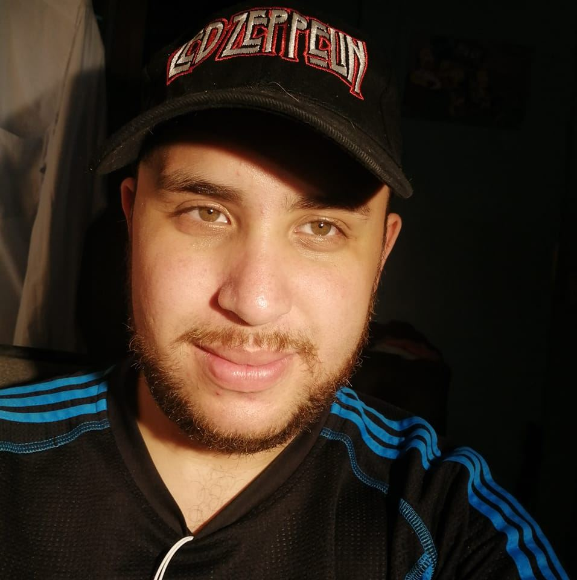

# *Wagner Chacon Ulate*

## Curriculum Vitae
### Información Personal 
- **Fecha de nacimiento**: 05/11/1993
- Cedúla: 402210043 
- Lugar de Habitación: _Central, Heredia, Costa Rica_

## Información Academica 
1. Bachillerato en educacion Media: _*Liceo Ing. Samuel Saenz Flores*_ 
2. Bachillerato en Historia: Universidad Nacional de Costa Rica 
3. Servicio al cliente: Academia Lider, Heredia 
4. Manipulación de alimentos: INA 

## Estudiando Geografía en la UCR.
[Escuela de Geografía UCR](https://www.geografia.fcs.ucr.ac.cr/)
 Fuente: Escuela de Geografía UCR

## Informacion de contacto: 
- Telefono: 7255-2248
- Email: wagner.chacon@ucr.ac.cr
- 

> _"En las montañas está la libertad. Las fuentes de la degradación no llegan a las regiones puras del aire. El mundo está bien en aquellos lugares donde el ser humano no alcanza  turbarlo con sus miserias.“_  
*Alexander Von Humboldt*

Fuente: [Alexander Von Humboldt](https://citas.in/autores/alexander-von-humboldt/)
